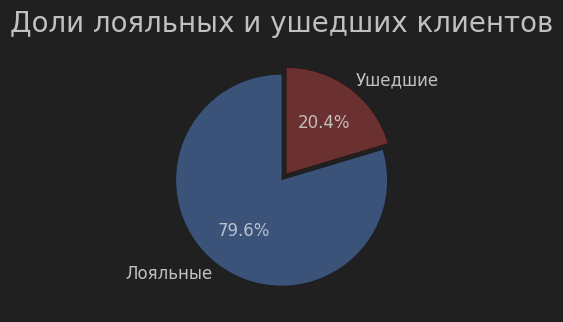
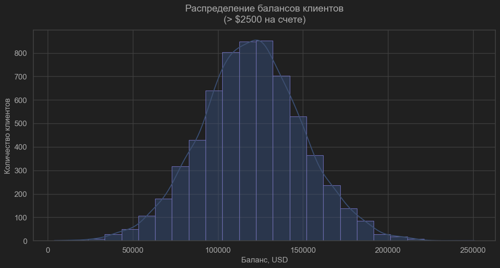
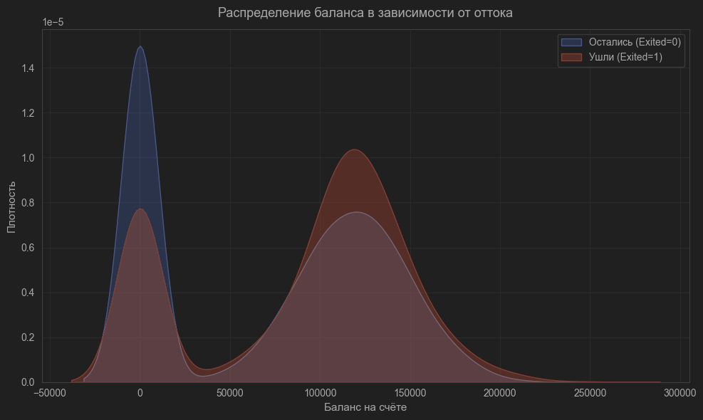
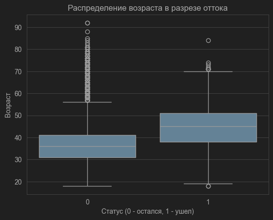
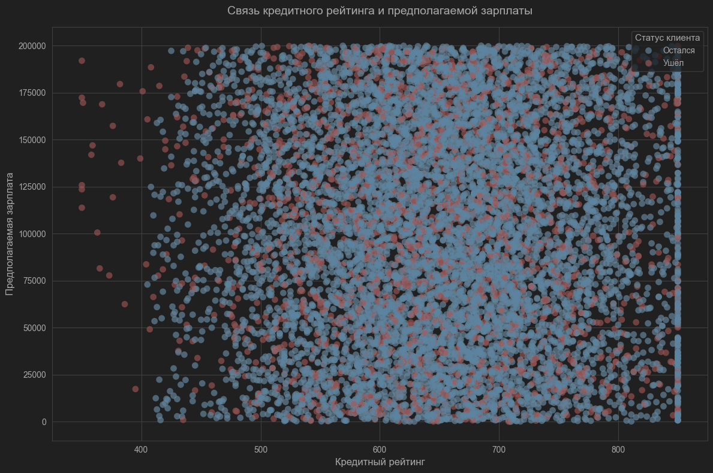
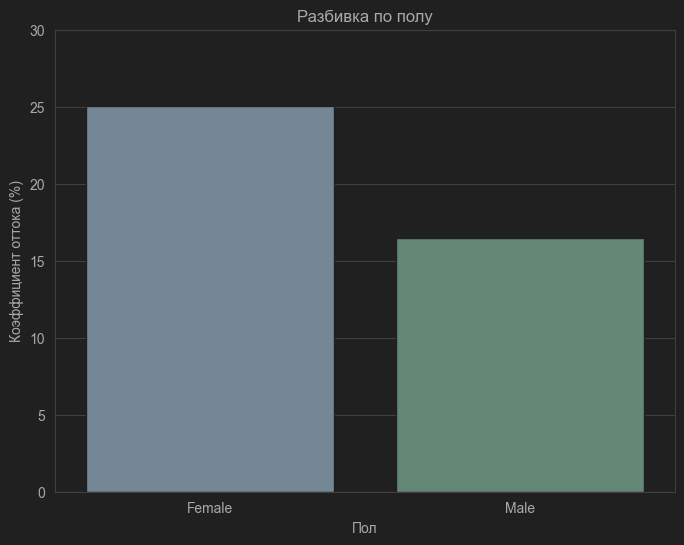
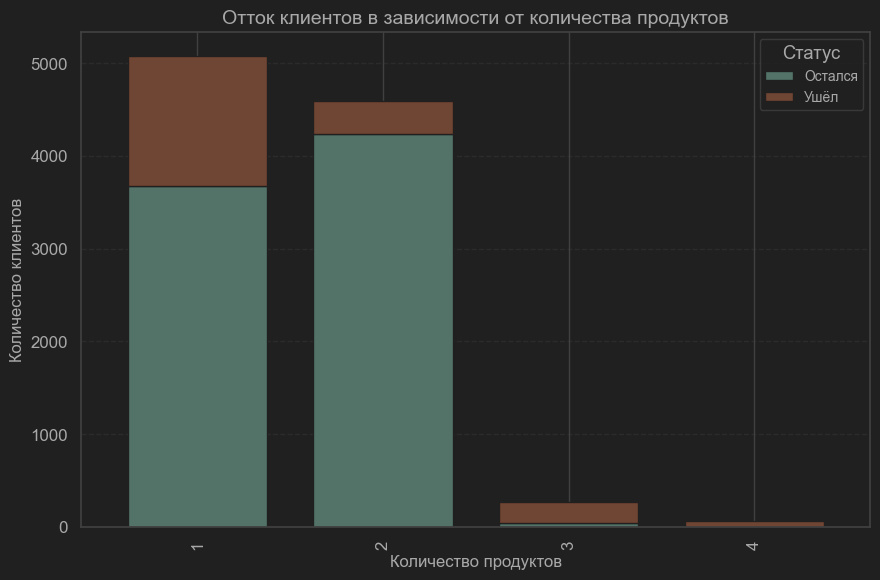
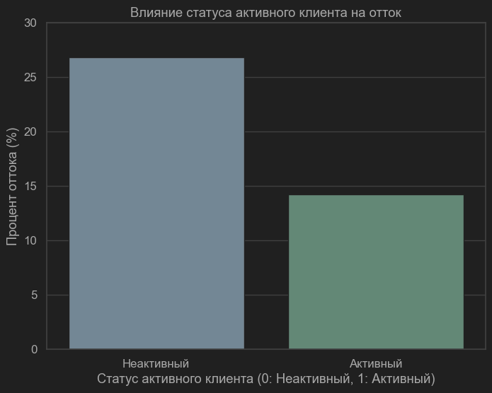
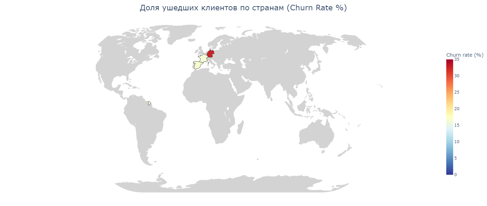
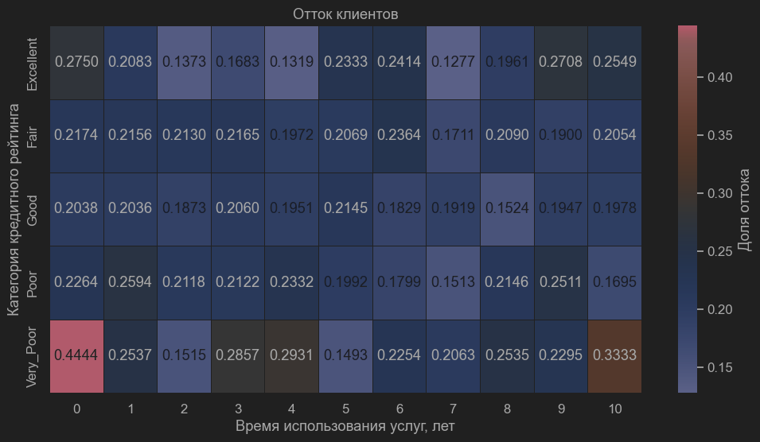

# Project 1. Анализ данных с помощью построения графиков.

## Оглавление
* [Описание проекта](https://github.com/NikolaiTsoi/sf_data_science/tree/main/project_1_visualization#описание-проекта)
* [Цели и Задачи](https://github.com/NikolaiTsoi/sf_data_science/tree/main/project_1_visualization#цель)
* [9.1. Определяем соотношение ушедших и лояльных клиентов.](https://github.com/NikolaiTsoi/sf_data_science/tree/main/project_1_visualization#9.1)
* [9.2. Демонстрация распределения баланса пользователей, у которых на счету больше 2 500 долларов.](https://github.com/NikolaiTsoi/sf_data_science/tree/main/project_1_visualization#9.2)
* [9.3. Распределение баланса клиента в разрезе признака оттока. Различия суммы на накопительном счёте ушедших и лояльных клиентов.](https://github.com/NikolaiTsoi/sf_data_science/tree/main/project_1_visualization#9.3)
* [9.4. Распределение возраста в разрезе признака оттока.](https://github.com/NikolaiTsoi/sf_data_science/tree/main/project_1_visualization#9.4)
* [9.5. Взаимосвязь кредитного рейтинга клиента и предполагаемой зарплаты.](https://github.com/NikolaiTsoi/sf_data_science/tree/main/project_1_visualization#9.5)
* [9.6. Попытка выявления взаимосвязей по половому признаку.](https://github.com/NikolaiTsoi/sf_data_science/tree/main/project_1_visualization#9.6)
* [9.7. Зависимость оттока клиентов от количества приобретенных у банка услуг.](https://github.com/NikolaiTsoi/sf_data_science/tree/main/project_1_visualization#9.7)
* [9.8. Влияние статуса активного клиента на отток клиентов.](https://github.com/NikolaiTsoi/sf_data_science/tree/main/project_1_visualization#9.8)
* [9.9. Доля ушедших клиентов в зависимости от страны.](https://github.com/NikolaiTsoi/sf_data_science/tree/main/project_1_visualization#9.9)
* [9.10. Построение тепловой карты для выявления категорий клиентов, которые уходят чаще всего.](https://github.com/NikolaiTsoi/sf_data_science/tree/main/project_1_visualization#9.10)
* [Выводы](https://github.com/NikolaiTsoi/sf_data_science/tree/main/project_0#выводы)

## Описание проекта
Необходимо проанализировать базу данных банка Х на предмет различий ушедших и лояльных клиентов и связи различных 
признаков, определяющих клиентов.
После разведывательного анализа, с целью выявления наиболее важных признаков оттока, банк сможет построить модель 
машинного обучения, которая будет прогнозировать уход клиента. 

### Цель: 
Выявление различий между двумя группами клиентов банка.

### Задача: 
Определить перечень ключевых признаков клиентов
В качестве наглядного подтверждения своей точки зрения отобразить закономерности на грифках и/или диаграммах

### Условия задачи:
* Имеется база данных, содержащая следующую информацию:
1. RowNumber — номер строки таблицы 
2. CustomerId — идентификатор клиента
3. Surname — фамилия клиента
4. CreditScore — кредитный рейтинг клиента (чем он выше, тем больше клиент брал кредитов и возвращал их)
5. Geography — страна клиента (банк международный)
6. Gender — пол клиента
7. Age — возраст клиента
8. Tenure — сколько лет клиент пользуется услугами банка
9. Balance — баланс на счетах клиента в банке
10. NumOfProducts — количество услуг банка, которые приобрёл клиент
11. HasCrCard — есть ли у клиента кредитная карта (1 — да, 0 — нет)
12. IsActiveMember — есть ли у клиента статус активного клиента банка (1 — да, 0 — нет)
13. EstimatedSalary — предполагаемая заработная плата клиента
14. Exited — статус лояльности (1 — ушедший клиент, 0 — лояльный клиент)* Программа должна определить это число
* Разрешено использование любых библиотек для визуализации данных (Plotly, Mathplotlib, Seaborn)

### Метрика качества: 
Результаты оцениваются по соответствию критериям визуализации, наличию описания графиков, выводов.

### Используемые методы:
Визуализация данных при помощи следующих библиотек:
* Pandas (ver. 2.3.3)
* Mathplotlib
* Seaborn (ver. 0.13.2)
* Plotly

## Этапы работы над проектом:

## 9.1. Определяем соотношение ушедших и лояльных клиентов.

Вывод: Банк демонстрирует довольно высокий уровень лояльности клиентов(почти 80%). Отток же составляет 20,4%, 
что может сигнализировать о различного рода проблемах как внутренних (качество обслуживания, высокая стоимость), 
так и внешних (изменения рынка, конкуренция). Для более точного определения причины необходим дальнейший анализ.

## 9.2. Демонстрация распределения баланса пользователей, у которых на счету больше 2 500 долларов.

* На данном графике мы можем наблюдать, что большинство активных пользователей с балансом >2500 долларов держат 
на счетах суммы в пределеах 120 000 долларов. Из этого можно сделать вывод, что типичным клиеном этого банка 
является представитель среднего класса.
* Малое количество крайних значений также подтверждает предыдущий тезис (ориентированность банка на средний класс).
* Практически симметричное распределение значений в свою очередь демонстрирует нам относительную однородность клиентской базы.

## 9.3. Распределение баланса клиента в разрезе признака оттока. Различия суммы на накопительном счёте ушедших и лояльных клиентов.

Наложение графиков различий сумм ушедших и лояльных клиентов дают нам следующую информацию:
* Ушедшие клиенты в среднем имеют остатки на счетах выше, чем лояльные.
* Распределение у оставшихся клиентов сильно смещено влево. Это может означать, что большинство лояльных клиентов держат 
на счёте небольшие суммы.
* У ушедших клиентов распределение гораздо шире. Что в свою очередь говорит о том, что среди ушедших, заметно больше 
людей с крупными накоплениями.

## 9.4. Распределение возраста в разрезе признака оттока.

Распределение показывает, что ушедшие клиенты в среднем старше (диапазон 40-50 лет) по сравнению 
с оставшимися (диапазон 31-41). Наибольшее количество потенциальных выбросов наблюдается в группе оставшихся клиентов. 
Банку стоит обратить внимание на возрастную категорию 39–51 год, так как в этой группе наблюдается наибольший отток.

## 9.5. Взаимосвязь кредитного рейтинга клиента и предполагаемой зарплаты.

* Точки распределены равномерно по всему диапазону значений без видимого паттерна. 
* Расцветка точек также не выявляет различий: ушедшие и оставшиеся клиенты распределены без заметных зон концентрации. 
Вывод: В данном случае можно с уверенностью говорить об остутствии взаимосвязи между кредитным рейтингом, предполагаемой 
зарплатой и оттоком клиентов.

## 9.6. Попытка выявления взаимосвязей по половому признаку.

Из данного графика видно, что женщины уходят значительно чаще мужчин

## 9.7. Зависимость оттока клиентов от количества приобретенных у банка услуг.

Данная диаграмма наглядно демонстрирует нам несколько моментов, на которых определенно стоит заострить внимание:
* Клиенты, которые приобрели 2 услуги у банка - самая низкая по уровню оттока.
* Клиенты, которые приобрели 1 услугу - вторая группа по уровню оттока. Самая очевидная стратегия - 
попытаться перевести как можно больше пользователей в группу с двумя услугами.
* Клиенты, которые приобрели 3 услуги - критическая зона. Уходит бОльшая часть пользователей. Можно предположить, что
это связано или с плохой взаимосвязью между услугами банка, или с тем, что в данную группу попали клиенту, которым 
банк дает много продуктов в попытке удержать от ухода.
* И наконец, клиенты, имеющие 4 услуги - небольшая выборка, 100% ушедших. Это может быть связано с эскалацией проблем 
из предыдущего пункта. Так или иначе, для полноценного анализа ситуации не достаточно данных об услугах банка.

## 9.8. Влияние статуса активного клиента на отток клиентов.

* Как можно видеть на этой диаграмме, статус активного клиента значительно влияет на отток. Процент оттока среди 
неактивных клиентов составляет около 26%, в то время как среди активных — всего 14%. Следовательно неактивные клиенты 
уходят почти в 2 раза чаще.
* Исходя из полученной информации можно предложить следующее:
1. Анализ причин неактивности. Выявить факторы риска посредством опросников, выявить критические точки, наметить 
стратегию и пошагово отрабатывать, периодически собирая обратную связь.
2. Введение специальных предложений за возобновление активности (например, кэшбэки), или элементов 
игры (очки за определенные действия, система достижений).
3. Постоянный мониторинг и аналитика данных. Разработка моделей для предсказания оттока и продуктивности контрмер.

## 9.9 Доля ушедших клиентов в зависимости от страны.

* В Германии доля ушедших клиентов наибольшая — более 30%. Для сравнения, во Франции она составляет около 15%, 
а в Испании около 16%. Это может быть связано с тем, что в Германии средний баланс на счетах клиентов значительно 
выше, чем в других странах. Такие клиенты более требовательны к качеству услуг, имеют больше альтернатив 
на конкурентном рынке банковских услуг в Германии, или чаще уходят из-за экономических факторов 
(инфляция, размер ключевой ставки).

## 9.10. Построение тепловой карты для выявления категорий клиентов, которые уходят чаще всего.

Анализируя данную тепловую карту можно с уверенностью сказать, что наиболее часто уходят клиенты 
с категорией "Very_Poor" (кредитный рейтинг 300–499):
1. Год 1: 44.44% (самый высокий отток). 
2. Год 11: 33.33%. 
3. Год 2: 25.37%. 
4. Год 9: 25.35%. 
5. Год 4: 28.95%.

Другие высокие значения:
* "Excellent" в первый год: 27.50%, и десятый: 27.08%.
* "Poor" на второй год: 25.94%, и десятый: 25.11%.

Вывод: Высокий отток у новых клиентов (первый и второй год) и долгосрочных (год девятый и десятый) в низких/высоких 
категориях рейтинга. "Very_Poor" — самая рискованная группа в целом.

## ВЫВОДЫ:
1. Несмотря на проблемы с оттоком клиентов, банк демонстрирует нам довольно высокий показатель лояльности клиентов (около 80%)
2. Банк имеет довольно однородную клиентскую базу, состояющую из представителей среднего класса со стабильными накоплениями.
3. Как правило, перестают пользоваться услугами банка наиболее состоятельные клиенты.
4. Наибольшую долю ушедших составляют клиенты в возрасте 39-51 год.
5. Кредитный рейтинг не зависит от предполагаемой заработной платы клиентов.
6. Женщины перестают тользоваться услугами банка чаще мужчин.
7. Самая лояльная группа клиентов - те, кто пользуется двумя услугами банка. Руководству стоит обратить внимание 
на пользователей одной услуги и по возможности быстрее перевести ее в следующую группу.
8. Степень активности клиента напрямую влияет на отток. Имеет смысл разработать систему специальных предложений 
и/или интерактивностей для удержания клиентов в статусе активных пользователей.
9. Наибольшее количество ушедших клиентов проживает в Германии (около 30%)
10. Чаще уходят клиенты с низким кредитным рейтингом в первые пару, либо на девятом-десятом году использования услуг банка.