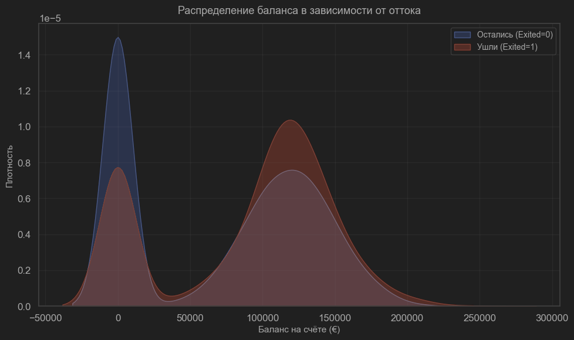

# Project 1. Анализ данных с помощью построения графиков.

## Оглавление
* [Описание проекта](https://github.com/NikolaiTsoi/sf_data_science/tree/main/project_0#описание-проекта)
* [Этапы работы над проектом](https://github.com/NikolaiTsoi/sf_data_science/tree/main/project_0#этапы-работы-над-проектом)
* [Выводы](https://github.com/NikolaiTsoi/sf_data_science/tree/main/project_0#выводы)

## Описание проекта
Необходимо проанализировать базу данных банка Х на предмет различий ушедших и лояльных клиентов и связи различных 
признаков, определяющих клиентов.
После разведывательного анализа, с целью выявления наиболее важных признаков оттока, банк сможет построить модель 
машинного обучения, которая будет прогнозировать уход клиента. 

### Цель: 
Выявление различий между двумя группами клиентов банка.

### Задача: 
Определить перечень ключевых признаков клиентов
В качестве наглядного подтверждения своей точки зрения отобразить закономерности на грифках и/или диаграммах

### Условия задачи:
* Имеется база данных, содержащая следующую информацию:
1. RowNumber — номер строки таблицы 
2. CustomerId — идентификатор клиента
3. Surname — фамилия клиента
4. CreditScore — кредитный рейтинг клиента (чем он выше, тем больше клиент брал кредитов и возвращал их)
5. Geography — страна клиента (банк международный)
6. Gender — пол клиента
7. Age — возраст клиента
8. Tenure — сколько лет клиент пользуется услугами банка
9. Balance — баланс на счетах клиента в банке
10. NumOfProducts — количество услуг банка, которые приобрёл клиент
11. HasCrCard — есть ли у клиента кредитная карта (1 — да, 0 — нет)
12. IsActiveMember — есть ли у клиента статус активного клиента банка (1 — да, 0 — нет)
13. EstimatedSalary — предполагаемая заработная плата клиента
14. Exited — статус лояльности (1 — ушедший клиент, 0 — лояльный клиент)* Программа должна определить это число
* Разрешено использование любых библиотек для визуализации данных (Plotly, Mathplotlib, Seaborn)

### Метрика качества: 
Результаты оцениваются по соответствию критериям визуализации, наличию описания графиков, выводов.

### Используемые методы:
Визуализация данных при помощи следующих библиотек:
* Pandas (ver. 2.3.3)
* Mathplotlib
* Seaborn (ver. 0.13.2)

## Этапы работы над проектом:
## 9.1. Определяем соотношение ушедших и лояльных клиентов.

* Вывод: Банк демонстрирует довольно высокий уровень лояльности клиентов(почти 80%). Отток же составляет 20,4%, 
что может сигнализировать о различного рода проблемах как внутренних (качество обслуживания, высокая стоимость), 
так и внешних (изменения рынка, конкуренция). Для более точного определения причины необходим дальнейший анализ.

## 9.2. Демонстрация распределения баланса пользователей, у которых на счету больше 2 500 долларов.

* На данном графике мы можем наблюдать, что большинство активных пользователей с балансом >2500 долларов держат 
на счетах суммы в пределеах 120 000 долларов. Из этого можно сделать вывод, что типичным клиеном этого банка 
является представитель среднего класса.
* Малое количество крайних значений также подтверждает предыдущий тезис (ориентированность банка на средний класс).
* Практически симметричное распределение значений в свою очередь демонстрирует нам относительную однородность клиентской базы.

## 9.3. Распределение баланса клиента в разрезе признака оттока. Различия суммы на накопительном счёте ушедших и лояльных клиентов

## Выводы
Модифицированный код успешно решает поставленную задачу
Среднее количество попыток значительно меньше установленного лимита в 20 попыток