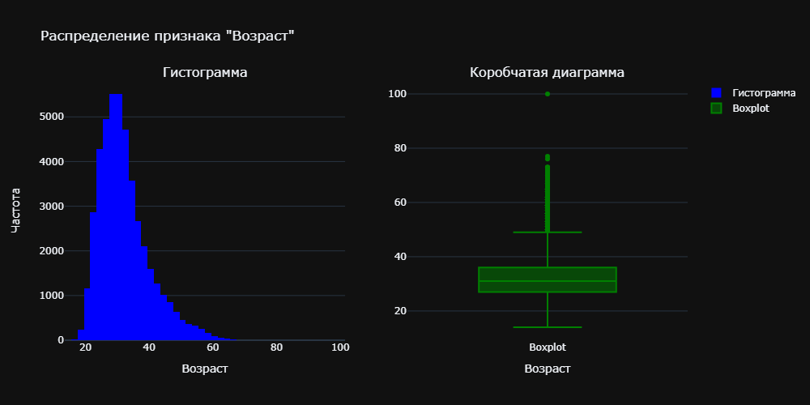
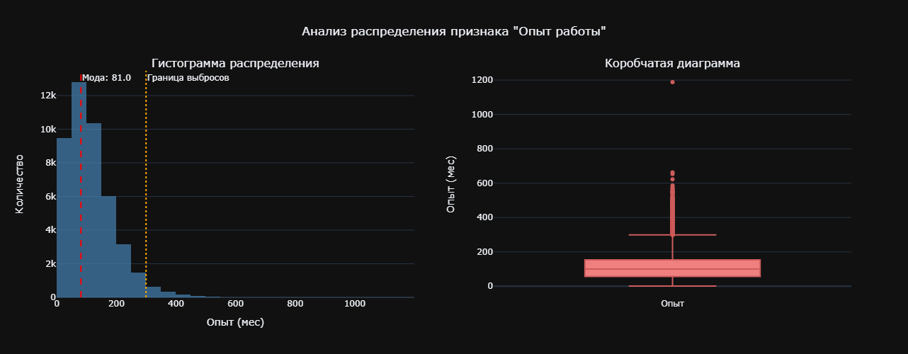
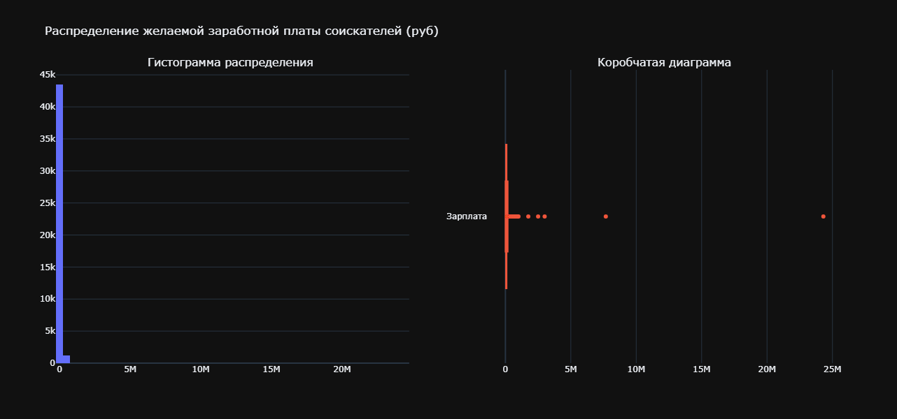
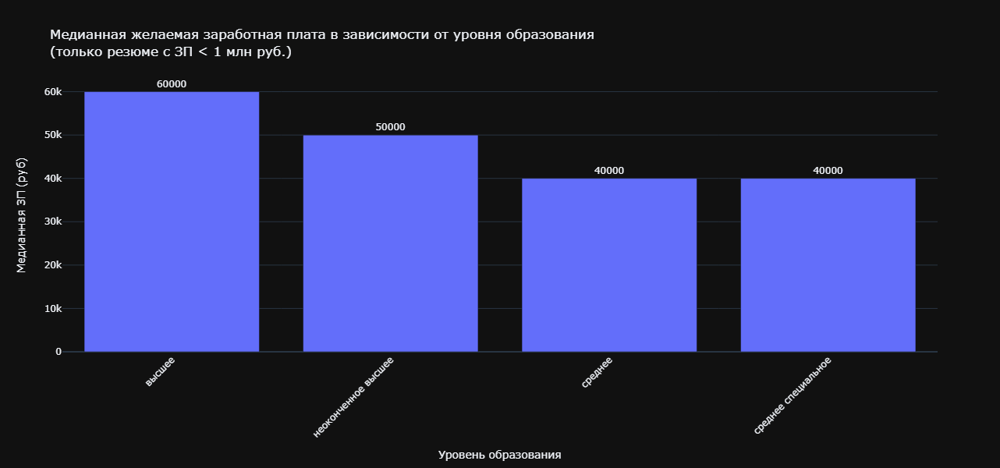
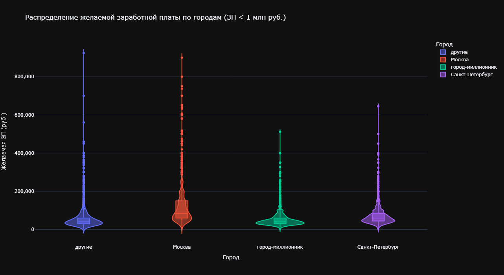
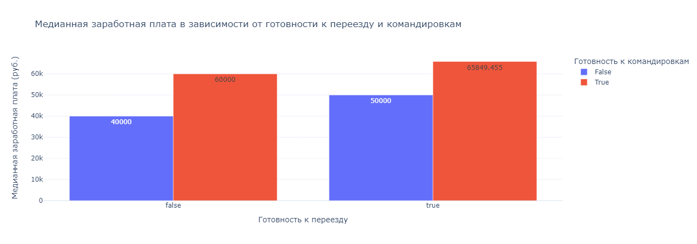
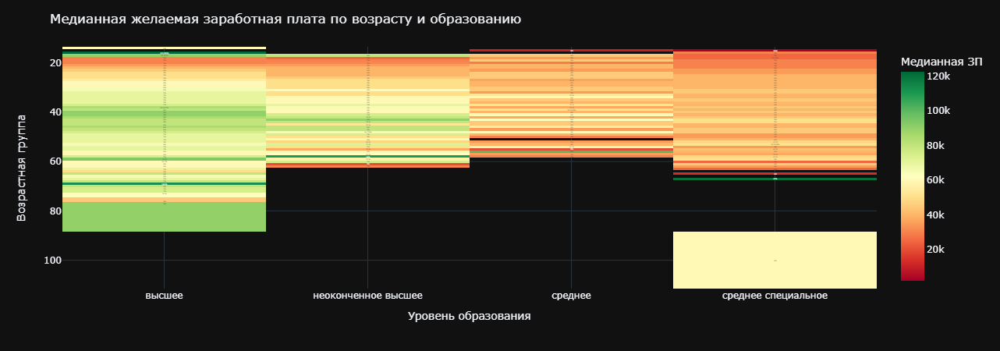
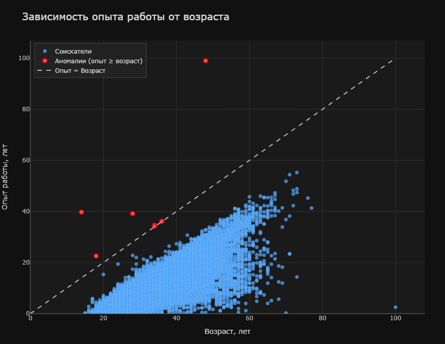
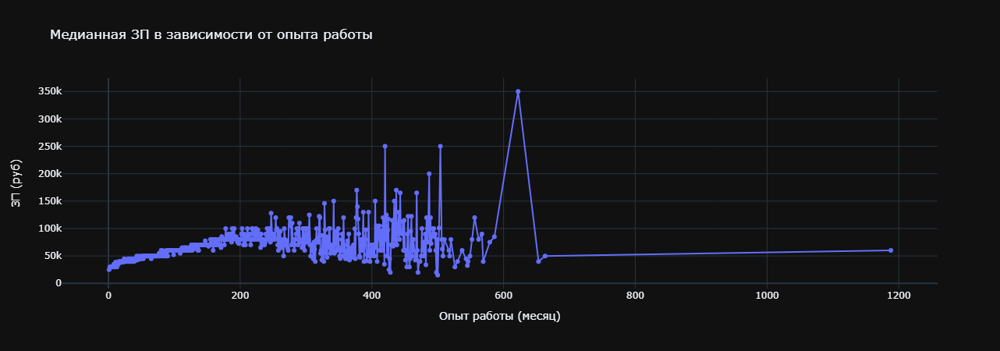
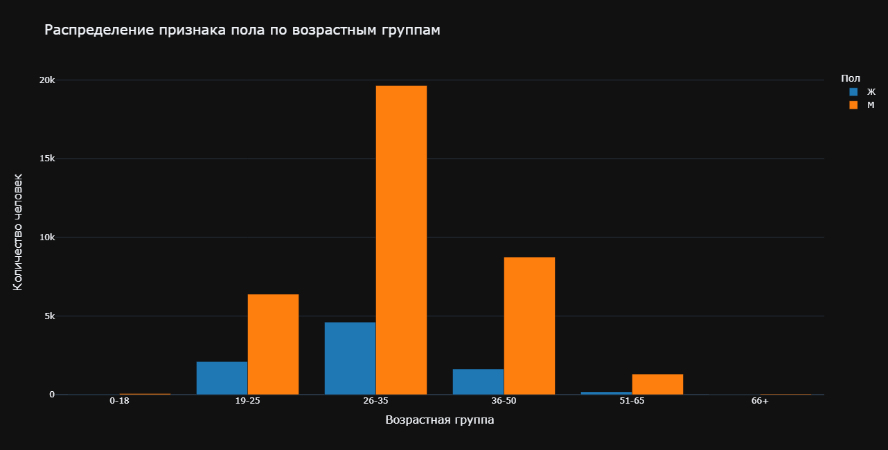

# 
 Project 2. Анализ резюме из HeadHunter.

## Оглавление
* [Описание проекта](https://github.com/NikolaiTsoi/sf_data_science/tree/main/project_2_headhunter#описание-проекта)
* [Цели и Задачи](https://github.com/NikolaiTsoi/sf_data_science/tree/main/project_2_headhunter#цель)
* [1. Исследование структуры данных.](https://github.com/NikolaiTsoi/sf_data_science/tree/main/project_2_headhunter#1-исследование-структуры-данных)
* [2. Преобразование данных](https://github.com/NikolaiTsoi/sf_data_science/tree/main/project_2_headhunter#2-преобразование-данных)
* [3. Исследование зависимостей в данных](https://github.com/NikolaiTsoi/sf_data_science/tree/main/project_2_headhunter#3-исследование-зависимостей-в-данных)
* [4. Очистка данных](https://github.com/NikolaiTsoi/sf_data_science/tree/main/project_2_headhunter#4-очистка-данных)

## Описание проекта
Компания HeadHunter хочет построить модель, которая бы автоматически определяла примерный уровень заработной платы, 
подходящей пользователю, исходя из информации, которую он указал о себе. Полученные данные необходимо преобразовать, 
исследовать и очистить.

### Цель: 
Преобразование исходного массива данных для последующего использования в построении желаемой клиентом модели

### Задачи: 
1. Провести базовый анализ структуры исходного массива
2. Преобразовать данные сообразно заявленной цели проекта
3. Провести разведывательный анализ тенденций и закономерностей в полученном массиве
4. Провести очистку данных от выбросов.

### Условия задачи:
* Имеется база данных с сайта hh.ru, содержащая резюме соискателей
* Разрешено использование любых библиотек для визуализации данных (Plotly, Mathplotlib, Seaborn)

### Метрика качества: 
Результаты оцениваются по:
* соответствию кода PEP 8 
* наличию описания визуализации, выводов
* верным ответам на промежуточные вопросы

### Используемые инструменты и библиотеки:
* Python (v3.13.7)

Визуализация данных при помощи следующих библиотек:
* Pandas (v2.3.3)
* Numpy (v2.3.5)
* Mathplotlib
* Seaborn (v0.13.2)
* Plotly

Ссылка на датасет: https://drive.google.com/file/d/1-FrV2PM4juwWkCTvWH3aNySM8peRFjxN/view?usp=sharing

## Этапы работы над проектом:

## 1. Исследование структуры данных.

Проверяем данные на повреждения, изучаем признаки и структуру массива.
Выводим основную информацию о массиве и информацию о числе непустых значений.

## 2. Преобразование данных

### 2.1 Создаем с помощью функции-преобразования новый признак **"Образование"**, который должен иметь 4 категории: 
* "высшее"
* "неоконченное высшее"
* "среднее специальное"
* "среднее".

### 2.2 Создаем два новых признака **"Пол"** и **"Возраст"**. При этом:
* Признак пола должен иметь 2 уникальных строковых значения: 'М' - мужчина, 'Ж' - женщина. 
* Признак возраста должен быть представлен целыми числами.

### 2.3 Из столбца **"Опыт работы"** необходимо выделить общий опыт работы соискателя в месяцах/
Новый признак назовем **"Опыт работы (месяц)"**

### 2.4 Далее, из столбца **"Город, переезд, командировки"** создадим отдельные признаки:
* "Город" 
* "Готовность к переезду"
* "Готовность к командировкам"

При этом, признак **"Город"** должен содержать 4 категории: 
* "Москва"
* "Санкт-Петербург"
* "город-миллионник" (список в ячейке кода)
* остальные обозначьте как "другие".

**Информация о метро, рядом с которым проживает соискатель нас не интересует.**

* Признак **"Готовность к переезду"** должен иметь два возможных варианта: True или False.
* Признак **"Готовность к командировкам"** должен иметь два возможных варианта: True или False.
     
ВАЖНО: при выгрузке данных у некоторых соискателей "потерялась" информация о готовности к командировкам. 
По умолчанию будем считать, что такие соискатели не готовы к командировкам.

### 2.5 На основании признаков **"Занятость"** и **"График"** создадим признаки-мигалки для каждой категории: 
если категория присутствует в списке желаемых соискателем, то в столбце на месте строки рассматриваемого соискателя ставится True, иначе - False.
Такой метод преобразования категориальных признаков называется One Hot Encoding и его схема представлена на рисунке ниже:

### 2.6 Преобразуем признак заработной платы **"ЗП"**
Cоздаем признак "ЗП (руб)" - заработная плата в рублях. Приводим к единой валюте.

Дополнительно: скачать с платформы выгрузку курсов валюти преобразовать сообразно условиям задачи.

## 3. Исследование зависимостей в данных

### 3.1 Распределение признака **"Возраст"**. 

### Выводы:
Распределение признака «Возраст» представляет собой асимметричное распределение с положительной асимметрией: 
основная масса значений сосредоточена в младших и средних возрастах, модальным значением в 30 лет, 
после чего частота постепенно снижается.

Предельные значения: минимум — 14 лет, максимум — 100 лет. 

Возраст большинства соискателей находится в интервале примерно от 27 до 36 лет.

В распределении данного признака присутствуют некоторые аномалии. 
К ним можно отнести крайне низкие значения (14–17 лет), 
поскольку такой возраст маловероятен для соискателей на рынке труда (возможно, ошибки ввода или нерелевантные резюме, 
например, школьников). Также аномальными можно назвать экстремально высокие значения (73, 76, 100 лет), 
которые могут быть ошибками данных или редкими случаями, но выходят за типичные границы.

### 3.2 Распределение признака **"Опыт работы (месяц)"**.

### Выводы:
Мода распределения равна 81.0 месяц. Предельные значения признака (минимум и максимум): 

Минимальное значение — 0 месяцев.
Максимальное значение — около 1200 месяцев.

Опыт работы большинства соискателей (более 90 % наблюдений) сосредоточен в интервале примерно 0–350 месяцев (0–29 лет). 
Основная масса значений находится в диапазоне 0–200 месяцев, а после 300–350 месяцев частота резко падает почти до нуля. 
В представленном массиве присутствуют аномалии. К ним можно отнести всё, что > 400 месяцев, и экстремальный выброс 1188. 
Эти значения сильно отрываются от основной массы и лежат за пределами нормального размаха для большинства соискателей.
В целом аспределение имеет существенную правостороннюю асимметрию.

Это означает, что большинство соискателей имеют небольшой или умеренный опыт работы, 
а с ростом стажа количество кандидатов быстро уменьшается. 

Мода находится в левой части, в интервале от 0 до 24 месяцев (до 2 лет), что типично для рынка труда: 
много начинающих специалистов, выпускников.

### 3.3 Распределение признака **"ЗП (руб)"**.

### Выводы:

Предельные значения признака (желаемой заработной платы):
* минимальное — 1 руб
* максимальное — 24304876 руб (правый выброс на коробчатой диаграмме).

Интервал, в котором находится зарплата большинства соискателей:
примерно 0 – 750 тысю руб.

Гистограмма показывает экстремально скошенное вправо распределение: 
почти вся масса наблюдений сосредоточена в самом первом столбце у нуля, дальше по оси почти ничего нет. 
Коробчатая диаграмма подтверждает это — основная «коробка» и усы лежат в нижней части шкалы, 
основная масса соискателей желает очень скромную зарплату.

Аномалии для признака зарплаты ярко выражены. На коробчатой диаграмме видны явные выбросы — на 7.67 млн руб и 
особенно на 24.3 млн руб (плюс ещё несколько точек правее уса). 
Это крайне нетипичные, аномально высокие значения, которые сильно тянут «хвост» распределения вправо и 
отличаются от основной массы соискателей (у которых зарплата в разы ниже). Вероятные причины: либо шутливые резюме, 
либо специалисты очень редких профессий, либо ошибки ввода данных (лишние нули и т.п.).
В любом случае эти значения сильно искажают среднее и другие характеристики, если их не исключать при анализе.

**Итого, мы имеем:** распределение крайне скошенное вправо, 
большинство соискателей желает очень скромную зарплату (до нескольких миллионов максимум), 
при этом присутствует небольшое количество гигантских аномальных значений, 
которые являются выбросами и требуют отдельного рассмотрения / фильтрации при статистическом анализе.

### 3.4 Диаграмма зависимости **медианной** желаемой зп (**"ЗП (руб)"**) от уровня образования (**"Образование"**).

### Выводы: 

* Наибольший уровень желаемой заработной платы наблюдается у соискателей с высшим образованием — медиана составляет 60 000 руб.
* Наименьший уровень — у соискателей со средним и средним специальным образованием — оба показывают одинаковую медиану 40 000 руб.
* Промежуточное значение — у неоконченного высшего образования: 50 000 руб.

Таким образом, чем выше уровень образования, тем выше медианная желаемая зарплата 
(разница между максимумом и минимумом — 20 000 руб., или 50 %).

**Важность признака «уровень образования» при прогнозировании заработной платы:**

Диаграмма демонстрирует чёткую зависимость: высшее образование даёт заметно более высокие ожидания по зарплате, 
а отсутствие высшего (среднее/среднее специальное) — ниже. Соответственно, уровень образования необходимо использовать 
как значимый признак в моделях прогнозирования ЗП, поскольку он объясняет существенную часть разброса желаемых зарплат.

### 3.5 Диаграмма распределения желаемой заработной платы (**"ЗП (руб)"**) в зависимости от города (**"Город"**). 

### Выводы:

1. Медианы практически одинаковы во всех группах (кроме, пожалуй, Москвы), и находятся в диапазоне ≈ 40–80 тыс. руб.:

* «другие» города (синий) — медиана около 40 тыс.
* Москва (оранжевый) — медиана около 80 тыс. 
* города-миллионники (зелёный) — медиана около 40 тыс. 
* Санкт-Петербург (фиолетовый) — медиана около 60 тыс.

Различия в медианах приблизительно 20 тыс. руб., то есть «типичный» соискатель хочет примерно одну и ту же сумму независимо от города.

2. Размах желаемой ЗП

Максимальный размах — у «других» городов и Москвы: длинные верхние «хвосты» уходят до 900+ тыс. руб. (вероятно, выбросы).
Санкт-Петербург — средний размах, верхняя граница 645 тыс. руб.
Города-миллионники — самый узкий размах, верхняя граница всего 511 тыс. руб., почти нет экстремально высоких желаний.

Вывод: при схожих медианах Москва и «другие» города дают гораздо больший разброс — люди там чаще указывают очень высокие размеры зп. 
В миллионниках распределение более однородное.

Важность признака «город» при прогнозировании заработной платы:
Да, признак города очень важен при прогнозировании заработной платы, так как формы распределений и особенно верхние 
хвосты сильно отличаются в зависимости от категории. Также данный признак отлично захватывает разницу в ожиданиях 
кандидатов (стоимость жизни, конкуренция, уровень вакансий).
Таким образом, признак даёт дополнительную интерпретацию (особенно для верхних квантилей и выбросов), 
что может бытькритично при прогнозировании реальной ЗП.

### 3.6 Многоуровневая столбчатая диаграмма, зависимости медианной заработной платы (**"ЗП (руб)"**) от признаков **"Готовность к переезду"** и **"Готовность к командировкам"**. 

### Выводы:

Среди тех, кто НЕ готов к переезду:

* Без готовности к командировкам — 40 000 ₽
* С готовностью к командировкам — 60 000 ₽ Разница: +20 000 ₽ (+50 %) 
Готовность к командировкам даёт очень сильный прирост к ожидаемой зп.

Среди тех, кто ГОТОВ к переезду (true):

* Без готовности к командировкам — 50 000 ₽
* С готовностью к командировкам — 65 849 ₽ Разница: +15 849 ₽ (+31,7 %) 
Признак готовности к командировкам остаётся значительным, но чуть слабее, чем в первой группе.

Самая высокая медианная зарплата — у кандидатов, готовых и к переезду, и к командировкам (65 849 ₽). 
Самая низкая — у тех, кто не готов ни к тому, ни к другому (40 000 ₽).
Готовность к командировкам влияет на зарплату сильнее и стабильнее, чем готовность к переезду. 
Готовность к переезду даёт дополнительный бонус, но только как дополнительный фактор — особенно заметен он у тех, кто не готов к командировкам.

### 3.7 Тепловая карта, зависимости **медианной** желаемой заработной платы от возраста (**"Возраст"**) и образования (**"Образование"**).

### Выводы:

1. По уровню образования (горизонтальное сравнение внутри одной возрастной группы)

* Высшее образование: медианная желаемая ЗП стабильно самая высокая (80–120+ тыс. руб.) у всех возрастов.
* Неоконченное высшее образование: зп заметно ниже (примерно 40–80 тыс. руб.), разница с высшим — 30–50 тыс. руб.
* Среднее образование: зарплатные ожидания еще ниже (30–60 тыс. руб.), разрыв с высшим достигает 50–80 тыс. руб.
* Среднее специальное образование: самые низкие значения (~20–40 тыс. руб.). Данные присутствуют в основном в старших возрастах (нижняя часть карты).

Вывод: чем выше уровень образования, тем выше медианная желаемая ЗП. 
Разница между высшим и средним специальным — до 80–100 тыс. руб. в одних и тех же возрастах.

2. По возрастным группам (вертикальное сравнение внутри одного уровня образования)

* Высшее: высокие значения почти равномерно по всей шкале возраста. Лёгкий подъём в средних возрастах, небольшое снижение только после 80 лет.
* Неоконченное высшее и среднее: чёткая тенденция снижения . Молодые (20–40 лет) желают заметно больше, чем люди 60+.
* Среднее специальное: данные сконцентрированы только в нижней части (старше ~70–80 лет) и остаются низкими без выраженного роста/падения.

Вывод: возраст влияет меньше, чем образование. У молодых людей (особенно с высшим) ожидания выше; 
с возрастом желаемая ЗП снижается преимущественно у групп с низким/средним образованием.

**Высшее образование даёт самый высокий уровень ожиданий по ЗП независимо от возраста.
Возрастной эффект вторичен. Молодёжь (20–40 лет) в целом желает больше, особенно с высшим образованием. 
После 60 лет ожидания падают у всех, кроме обладателей диплома о высшем образовании.
Среднее специальное — особая группа. Очень низкие значения и данные только для старших возрастов. 
Вероятно, это люди с узкоспециализированным средним образованием(техникумы, ПТУ), которые либо уже на пенсии, либо работают в низкооплачиваемых сферах.
Пробелы в данных. Белые/светло-жёлтые зоны в нижней правой части (среднее специальное + старшие возрасты) 
и частичные пустоты в средних возрастах показывают, где данных недостаточно.**

### 3.8 Диаграмма рассеяния, показывающая зависимости опыта работы (**"Опыт работы (месяц)"**) от возраста (**"Возраст"**). 

### Выводы: 

* В возрасте 20–30 лет точки плотно собраны внизу — опыт от 0 до 10–12 лет.
* С увеличением возраста облако точек сильно расширяется вверх. Особенно это заметно после 40 лет.
* Самая плотная концентрация значений, находится в диапазоне 25–55 лет и 5–35 лет опыта.
* После 60 лет появляется много людей с относительно небольшим опытом (10–25 лет), хотя есть и те, у кого опыт 40–55 лет.

* Аномалий 7: Эти точки явно нереалистичные (опыт не может быть равен или больше возраста).
* Данные показывают ожидаемую положительную связь: чем старше человек, тем больше у него, как правило, опыта. 
Однако разброс опыта с возрастом сильно растёт.

График хорошо иллюстрирует, что:
* До 40–45 лет опыт довольно предсказуем.
* После 50 лет картина становится очень разнообразной (от почти нулевого опыта до очень большого).

## Дополнительные диаграммы

### 3.9 Зависимость медианной заработной платы от опыта работы

### Выводы:

* Максимальный эффект наблюдается только первые 15–17 лет карьеры. 
Дальше дополнительный год опыта практически не даёт прироста зарплаты.
* Пик на 50 годах опыта — почти наверняка выброс.
* Скорее всего, это 1–2 очень высокооплачиваемых специалиста (топ-менеджеры, узкие эксперты-консультанты или владельцы бизнеса), 
которые указали именно такой стаж. 
* Медианная ЗП резко падает до 50–60 тыс. руб. и дальше не меняется. 
Это скорее всего пенсионеры, подработки, неполная занятость или ошибки при вводе опыта.
* Таких наблюдений очень мало, поэтому медиана стабилизируется на низком уровне.

Итоговый вывод:
На рынке труда опыт даёт заметный прирост зарплаты только в первые 15–17 лет. 
После этого медианная зарплата перестаёт расти и начинает сильно зависеть от других параметров. 
Всё, что выше 45–50 лет стажа, — скорее всего выбросы.
График хорошо иллюстрирует классическую картину закона убывающей отдачи + влияние выбросов на медиану при малом количестве наблюдений.

### 3.10 Распределение признака пола по возрастным группам.

Выводы:

* Сильный мужской перекос во всех возрастных группах, особенно ярко выраженный в трудоспособном возрасте.
* Пик численности приходится на группу 26-35 лет — это самая большая группа (около 20 тыс. человек), 
причём мужчин там почти в 4 раза больше, чем женщин.
* Группа 36-50 лет — вторая по численности, тоже с заметным преобладанием мужчин (примерно 5:1).
* В группе 19-25, соотношение мужчин и женщин тоже сильно в пользу мужчин (3:1).
* После 50 лет количество людей резко падает, особенно женщин. В группе 66+ людей практически нет.

График показывает очень неравномерное распределение в сторону мужского пола. 
Основная масса людей сосредоточена в возрасте 19–50 лет. 
Женщин относительно мало во всех группах, особенно после 35 лет.
Такое распределение очень характерно для технических/ИТ-компаний, игровой индустрии, 
строительства или логистических коллективов — то есть сфер, где традиционно сильно преобладают мужчины.

## 4. Очистка данных

### 4.1. Найдем **полные дубликаты** в таблице с резюме и удалим их.

Обнаружено и удалено дубликатов: 158

### 4.2 Выведем информацию **о числе пропусков** в столбцах. 

Ищет работу на должность:            0
Последнее/нынешнее место работы      1
Последняя/нынешняя должность         2
Обновление резюме                    0
Авто                                 0
Образование                          0
Пол                                  0
Возраст                              0
Опыт работы (месяц)                168
Город                                0
Готовность к переезду                0
Готовность к командировкам           0
Занятость_полная занятость           0
Занятость_частичная занятость        0
Занятость_проектная работа           0
Занятость_волонтерство               0
Занятость_стажировка                 0
График_полный день                   0
График_сменный график                0
График_гибкий график                 0
График_удалённая работа              0
График_вахтовый метод                0
ЗП (руб)                             0

### 4.3 Удалим строки, где есть пропуск в столбцах с местом работы и должностью. 
Пропуски в столбце с опытом работы заполните **медианным** значением.

Медианное значение опыта работы: 100.0 месяцев
Осталось строк после очистки: 44584

### 4.4 Удалим резюме, в которых указана заработная плата либо выше 1 млн. рублей, либо ниже 1 тыс. рублей.

Было строк: 44584, осталось: 44495
Найдено выбросов: 89

### 4.5 Найдем и удалим резюме, в которых **опыт работы в годах превышал возраст соискателя**.

Найдено аномальных резюме, где опыт превышает возраст: 7
После очистки осталось записей: 44488

### 4.6 Построим распределение признака **"Возраст" в логарифмическом масштабе**. 

Найдем выбросы с помощью метода z-отклонения и удалим их из данных, при помощи логарифмического масштаба. 
Выведем таблицу с полученными выбросами и оценим, с каким возрастом соискатели попадают под категорию выбросов?

* 30980     15
* 32793     15
* 33497    100

## Примечания:
* интерактивные графики в ячейках с кодом
* ответы на промежуточные вопросы также находятся в ячейках с кодом, в комментариях